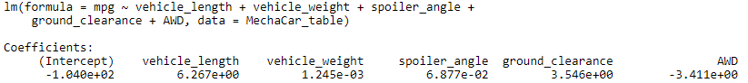
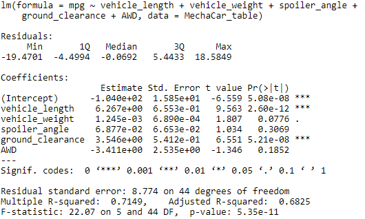
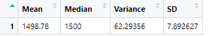
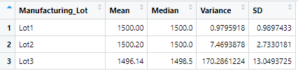
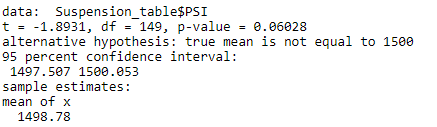
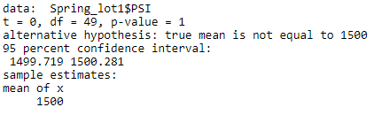
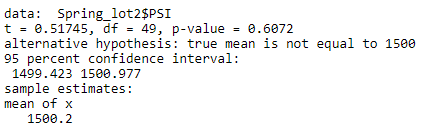
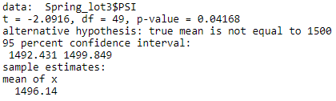

# MechaCar_Statistical_Analysis

## Linear Regression to Predict MPG

From the input data found in MechaCar_mpg.csv, a linear regression analysis was performed.  This showed that vehicle length and ground clearance provided a non-random amount of variance to the mpg values in the dataset as shown below in the summary results in the "Pr(>|t|) column.

From our linear regression model, the r-squared value is 0.72, which means that roughly 72% of the variablilty of our dependent variable (miles per gallon) is explained using this linear model. Vehicle lenth and ground clearance has the most siginificant correlatino impact, while vehicle weight has some impact.  Spoiler angle and AWD do not correlated to MPG.

The slope of the linear model would not be considered zero because of the correlation between MPG and the values mentioned above.

This linear modem gives insights as to how vehicle length and ground clearance influence MPG, but there would still be additional data to collect to provide the full picture on all the items that influence MPG.

## Summary Statistics on Suspension Coils
The design specifications for the MechaCar suspension coils dictate that the variance of the suspension coils must not exceed 100 pounds per square inch. Based on the below summarized data of spring PSI for all springs and from each Lot, other than Lot 1 and Lot 2, do not meet this design specification because the variance is larger than 50.

Summary of all springs PSI data:

Summary of springs PSI data broken down by Lot number:

## T-Tests on Suspension Coils
Perform t-tests to determine if all manufacturing lots and each lot individually are statistically different from the population mean of 1,500 pounds per square inch.

Assuming our significance level was the common 0.05 percent, our p-values for the following results are:

- All Springs:
    - 
    - p-value of 0.06 so there is no statistical signifigiance between this data and the average of 1500 PSI.
- Lot 1 Springs:
    -   
    - p-value of 1 so there is no statistical signifigiance between this data and the average of 1500 PSI.
- Lot 2 Springs:
    - 
    - p-value of 0.6 so there is no statistical signifigiance between this data and the average of 1500 PSI.
- Lot 3 Springs:
    - 
    - p-value of 0.04 so there is a statistical signifigiance between this data and the average of 1500 PSI.

## Study Design: MechaCar vs Competition
A statistical study will now be created to compare performance of the MechaCar vehicles against performance of vehicles from other manufacturers.

statistical study that can quantify how the MechaCar performs against the competition. In your study design, think critically about what metrics would be of interest to a consumer: for a few examples, cost, city or highway fuel efficiency, horse power, maintenance cost, or safety rating

- What metric or metrics are you going to test?
- What is the null hypothesis or alternative hypothesis?
- What statistical test would you use to test the hypothesis? And why?
- What data is needed to run the statistical test?